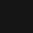
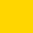

# **Kollection Branding Assets and Guidelines**

The following Kollection \"Brand Assets\" may only be used if they are
in accordance with the policy detailed below:

-   The Kollection logos, wordmark, icon

-   The Kollection name

-   Other visual assets produced by Kollection including but not limited
    > to illustrations and 3d models

## **What you may do**

You may use Kollection\'s Brand Assets when you are:

-   Referring to our products and services

-   Linking to our official site or products, such as \"Buy my NFT on
    > Kollection\"

-   Announcing an official partnership, but only if you have **official
    > approval** by a qualified member of the Kollection team

For information on other uses of our Brand Assets, please reach out to
Kollection group.

## **What you may not do**

While we strongly believe in and follow the open source ethos,
**protecting the Kollection brand is extremely important for our users\'
security,** so that users know what is a genuine product/endorsement and
what isn\'t.

Here are a few examples of forbidden uses of our Brand Assets:

-   **Don\'t use our Brand Assets in your products\' name, logo, NFTs,
    > etc.**

    -   For example, making an app called \"Kollection Engine\" or
        > \"Kollection Child\" are not allowed.

    -   Don\'t use the Kollection logo in whole or in part as part of
        > your products\' logos, marketing material, website, or other.

    -   Logos with a strong resemblence to the Kollection Icon are also
        > forbidden.

-   **Don\'t use our Brand Assets to create digital or physcial products
    > for sale, including but not limited to**

    -   Merchandise (\"Swag\")

    -   NFTs

    -   Other products

-   **Don\'t create derivative names that imply official endorsement\
    > **For example, don\'t make a social media group called
    > \"Kollection Italy\" - this sounds official. \"Kollection Fans of
    > Italy\" may be permitted.

-   **Don\'t change or adapt our Brand Assets in any way\
    > **Use the logos and other assets exactly as provided. Do not
    > change the colors, reassemble, abbreviate, or change these assets
    > in any way.

Use your common sense and creativity. If you want to make something
relating to the Kollection ecosystem, make it your own.

By downloading these files, you confirm that you will only use it to the
extent permitted by the Terms detailed in this page.

### **Colors**

| Name              | Hex Code    |             Swatch             |
| ------------------|:-----------:|:------------------------------:|
| Kollection Black  | 151515      |    |
| Kollection Yellow | FFD600      |    |
| Kollection White  | FFFFFF      |    |

### **Font**

Kollection logo font is Montserrat

The old posters and signs in the traditional *Montserrat* neighborhood
of Buenos Aires inspired Julieta Ulanovsky to design this typeface and
rescue the beauty of urban typography that emerged in the first half of
the twentieth century. As urban development changes that place, it will
never return to its original form and loses forever the designs that are
so special and unique. The letters that inspired this project have work,
dedication, care, color, contrast, light and life, day and night! These
are the types that make the city look so beautiful. The Montserrat
Project began with the idea to rescue what is in Montserrat and set it
free under a libre license, the SIL Open Font License.

This is the normal family, and it has two sister families so far,
[Alternates](http://fonts.google.com/specimen/Montserrat+Alternates) and
[Subrayada](http://fonts.google.com/specimen/Montserrat+Subrayada). Many
of the letterforms are special in the Alternates family, while
\'Subrayada\' means \'Underlined\' in Spanish and celebrates a special
style of underline that is integrated into the letterforms found in the
*Montserrat* neighborhood.

Updated November 2017: The family was redrawn by Jacques Le Bailly at
[Baron von Fonthausen](http://www.baronvonfonthausen.com/) over the
summer, and the full set of weights were adjusted to make the Regular
lighter and better for use in longer texts. In fall, Julieta Ulanovsky,
Sol Matas, and Juan Pablo del Peral, led the development of Cyrillic
support, with consultation with Carolina Giovagnoli, Maria Doreuli, and
Alexei Vanyashin.

Kollection body text font is Albert Sans

Albert Sans is a modern geometric sans serif family, inspired by the
type-characteristics of scandinavian architects and designers in the
early 20th century. The Albert Sans family includes ten weights from
Thin to Black and supports over two hundred languages.
